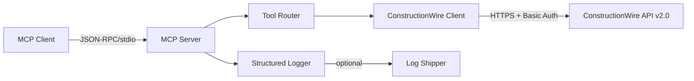

# ConstructionWire MCP Server

[](https://www.npmjs.com/package/@west10tech/constructionwire-mcp)
[]()
[](LICENSE)
[](https://modelcontextprotocol.io)

A production-ready [Model Context Protocol](https://modelcontextprotocol.io) server that provides full access to the [ConstructionWire API](https://www.constructionwire.com) — 75 tools covering construction project intelligence, company data, people tracking, and more.

## Features

| Feature | Details |
|---------|---------|
| **75 API Tools** | Complete coverage of ConstructionWire API v2.0 |
| **Typed Interfaces** | TypeScript parameter/response types for all endpoints |
| **Retry Logic** | Exponential backoff with jitter for transient failures |
| **Progress Notifications** | Real-time progress updates for long-running operations |
| **Request Cancellation** | Full MCP cancellation protocol support |
| **Structured Logging** | JSON logging with optional centralized log shipping |
| **Rate Limiting** | Configurable request throttling |

## Quick Start

### Install

```bash
npm install @west10tech/constructionwire-mcp
```

### Configure

Set your ConstructionWire API credentials:

```env
CONSTRUCTIONWIRE_USERNAME=your_username
CONSTRUCTIONWIRE_PASSWORD=your_password
```

### Use with Claude Desktop

Add to your Claude Desktop config (`~/Library/Application Support/Claude/claude_desktop_config.json`):

```json
{
  "mcpServers": {
    "constructionwire": {
      "command": "npx",
      "args": ["@west10tech/constructionwire-mcp"],
      "env": {
        "CONSTRUCTIONWIRE_USERNAME": "your_username",
        "CONSTRUCTIONWIRE_PASSWORD": "your_password"
      }
    }
  }
}
```

### Use with Claude Code

Add to your Claude Code settings:

```json
{
  "mcpServers": {
    "constructionwire": {
      "command": "npx",
      "args": ["@west10tech/constructionwire-mcp"],
      "env": {
        "CONSTRUCTIONWIRE_USERNAME": "your_username",
        "CONSTRUCTIONWIRE_PASSWORD": "your_password"
      }
    }
  }
}
```

## Architecture

```
src/
├── index.ts                    # MCP server entry point & handler setup
├── config.ts                   # Environment configuration & validation
├── types.ts                    # TypeScript interfaces & type definitions
├── clients/
│   └── constructionwire-client.ts  # HTTP client (75 endpoint methods)
├── tools/
│   └── constructionwire-tools.ts   # MCP tool definitions & routing
└── services/
    ├── logger.ts               # Structured JSON logging
    ├── log-batcher.ts          # Log batching for shipping
    ├── log-shipper.ts          # HTTP log shipping
    ├── request-tracker.ts      # Request lifecycle & cancellation
    └── progress-reporter.ts    # MCP progress notifications
```



## Available Tools (75)

### Reports (20 tools)

| Tool | Description |
|------|-------------|
| `constructionwire_reports_list` | List construction projects (search/filter) |
| `constructionwire_reports_get` | Get a project by ID |
| `constructionwire_reports_files` | List project files (plans/specs) |
| `constructionwire_reports_file` | Get a specific project file |
| `constructionwire_reports_notes` | List project notes |
| `constructionwire_reports_note` | Get a project note |
| `constructionwire_reports_questions` | List project questions |
| `constructionwire_reports_add_question` | Create a project question |
| `constructionwire_reports_question` | Get a project question |
| `constructionwire_reports_answers` | List answers to a question |
| `constructionwire_reports_answer` | Get an answer |
| `constructionwire_reports_tasks` | List project tasks |
| `constructionwire_reports_task` | Get a project task |
| `constructionwire_reports_facets` | List project facets |
| `constructionwire_reports_file_terms` | Get file terms & conditions |
| `constructionwire_reports_add_file_terms` | Accept file terms & conditions |
| `constructionwire_reports_follow` | Follow a project |
| `constructionwire_reports_unfollow` | Unfollow a project |
| `constructionwire_reports_following` | List followed projects |
| `constructionwire_reports_all_questions` | List all project questions |

### Companies (13 tools)

| Tool | Description |
|------|-------------|
| `constructionwire_companies_list` | List companies (search/filter) |
| `constructionwire_companies_get` | Get a company by ID |
| `constructionwire_companies_locations` | List company locations |
| `constructionwire_companies_location` | Get a company location |
| `constructionwire_companies_people` | List company's people |
| `constructionwire_companies_projects` | List company's project activities |
| `constructionwire_companies_relationships` | List company's relationships |
| `constructionwire_companies_stats` | Get company statistics |
| `constructionwire_companies_facets` | List company facets |
| `constructionwire_companies_following` | List followed companies |
| `constructionwire_companies_follow` | Follow a company |
| `constructionwire_companies_unfollow` | Unfollow a company |
| `constructionwire_companies_all_locations` | List locations across companies |

### People (9 tools)

| Tool | Description |
|------|-------------|
| `constructionwire_people_list` | List people (search/filter) |
| `constructionwire_people_get` | Get a person by ID |
| `constructionwire_people_projects` | List person's project activities |
| `constructionwire_people_relationships` | List person's relationships |
| `constructionwire_people_stats` | Get person statistics |
| `constructionwire_people_facets` | List people facets |
| `constructionwire_people_following` | List followed people |
| `constructionwire_people_follow` | Follow a person |
| `constructionwire_people_unfollow` | Unfollow a person |

### Folders (6 tools)

| Tool | Description |
|------|-------------|
| `constructionwire_folders_list` | List folders |
| `constructionwire_folders_create` | Create a folder |
| `constructionwire_folders_get` | Get a folder |
| `constructionwire_folders_update` | Update a folder |
| `constructionwire_folders_delete` | Delete a folder |
| `constructionwire_folders_add_item` | Add item to a folder |

### Notes (5 tools)

| Tool | Description |
|------|-------------|
| `constructionwire_notes_list` | List notes |
| `constructionwire_notes_create` | Create a note |
| `constructionwire_notes_get` | Get a note |
| `constructionwire_notes_update` | Update a note |
| `constructionwire_notes_delete` | Delete a note |

### Tasks (5 tools)

| Tool | Description |
|------|-------------|
| `constructionwire_tasks_list` | List tasks |
| `constructionwire_tasks_create` | Create a task |
| `constructionwire_tasks_get` | Get a task |
| `constructionwire_tasks_update` | Update a task |
| `constructionwire_tasks_delete` | Delete a task |

### Saved Searches (4 tools)

| Tool | Description |
|------|-------------|
| `constructionwire_searches_list` | List saved searches |
| `constructionwire_searches_create` | Create a saved search |
| `constructionwire_searches_get` | Get a saved search |
| `constructionwire_searches_update` | Update a saved search |

### Subscriptions (2 tools)

| Tool | Description |
|------|-------------|
| `constructionwire_subscriptions_create_free` | Create a free subscription |
| `constructionwire_subscriptions_usage` | Get subscription usage reports |

### News (2 tools)

| Tool | Description |
|------|-------------|
| `constructionwire_news_list` | List product news |
| `constructionwire_news_get` | Get a product news entry |

### Authentication (4 tools)

| Tool | Description |
|------|-------------|
| `constructionwire_auth_login` | Create an access token |
| `constructionwire_auth_details` | Get authenticated session details |
| `constructionwire_auth_logout` | Logout from session |
| `constructionwire_auth_subscription` | Get subscription for current session |

### Common/Reference Data (5 tools)

| Tool | Description |
|------|-------------|
| `constructionwire_common_get_list` | Get a common list by ID |
| `constructionwire_common_retail_chains` | List retail chains |
| `constructionwire_common_states` | List US states |
| `constructionwire_common_counties` | List counties for a state |
| `constructionwire_common_regions` | List US state regions |

## Environment Variables

| Variable | Required | Default | Description |
|----------|----------|---------|-------------|
| `CONSTRUCTIONWIRE_USERNAME` | Yes | — | API username |
| `CONSTRUCTIONWIRE_PASSWORD` | Yes | — | API password |
| `CONSTRUCTIONWIRE_MAX_RETRIES` | No | `3` | Max retry attempts for transient failures |
| `LOG_SHIPPING_ENABLED` | No | `false` | Enable centralized log shipping |
| `LOG_INGESTION_URL` | No | — | Log shipping endpoint (HTTPS required) |
| `LOG_INGESTION_API_KEY` | No | — | API key for log shipping |
| `LOG_LEVEL` | No | `ERROR` | Log level: DEBUG, INFO, WARN, ERROR, FATAL |
| `LOG_SHIPPING_BATCH_SIZE` | No | `500` | Logs per batch (1-1000) |
| `LOG_SHIPPING_INTERVAL` | No | `5000` | Batch flush interval in ms (min 1000) |
| `LOG_SHIPPING_MAX_RETRIES` | No | `3` | Log shipping retry attempts |

## Getting API Credentials

ConstructionWire API access is provided through their Data Services team — there is no self-serve developer portal.

1. **Phone (fastest):** Call **+1 (866) 316-5300** (Mon-Fri, 9am-5pm Central) and ask for API access.
2. **Email:** Send a request to **success.us@hubexo.com** asking for API trial credentials for `api.constructionwire.com`.
3. **Free trial:** Submit at [constructionwire.com/free-trial](https://info.buildcentral.com/free-trial-constructionwire).

### References

- [API Documentation (Postman)](https://www.postman.com/buildcentral/public/documentation/gxn6y0g/constructionwire-api-2-0)
- [API Brochure (PDF)](https://www.constructionwire.com/Content/pdf/buildcentral_api.pdf)
- [Data Services](https://www.constructionwire.com/DataServices)

## Advanced Features

### Retry Logic

The client automatically retries on transient failures (HTTP 429, 500, 502, 503, 504) with exponential backoff:

- **Delay pattern:** 1s, 2s, 4s (with random jitter)
- **Retry-After:** Respected when present in the response
- **Configurable:** Set `CONSTRUCTIONWIRE_MAX_RETRIES=0` to disable

### Request Cancellation

Supports the [MCP cancellation specification](https://modelcontextprotocol.io/specification/2025-06-18/basic/utilities/cancellation). Clients can cancel in-progress requests by sending `notifications/cancelled` with the request ID.

### Progress Notifications

Supports the [MCP progress specification](https://modelcontextprotocol.io/specification/2025-06-18/basic/utilities/progress). Include a `progressToken` in your request metadata to receive `notifications/progress` updates.

```json
{
  "method": "notifications/progress",
  "params": {
    "progressToken": "op-123",
    "progress": 45,
    "total": 100,
    "message": "Processing item 45 of 100..."
  }
}
```

## Troubleshooting

| Problem | Solution |
|---------|----------|
| `CONSTRUCTIONWIRE_USERNAME is required` | Set `CONSTRUCTIONWIRE_USERNAME` environment variable |
| `401 Unauthorized` | Check credentials are correct; call CW support if locked out |
| `429 Too Many Requests` | Reduce request frequency; retry logic handles this automatically |
| `ECONNREFUSED` | Verify `api.constructionwire.com` is reachable from your network |
| `Request timeout` | Increase timeout or check network connectivity |
| Tools not appearing in Claude | Verify the MCP config JSON is valid and restart Claude |

## Development

```bash
npm run dev        # Development mode with hot reload
npm run build      # Compile TypeScript
npm test           # Run unit tests (146 tests)
npm run test:e2e   # Run E2E tests (26 tests)
npm run test:all   # Run all tests
npm run lint       # Run ESLint
```

## License

MIT
